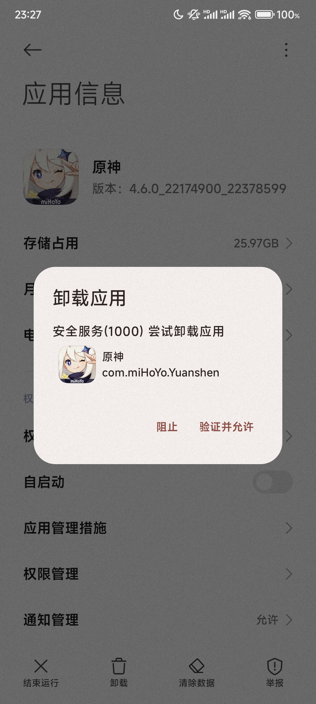

# BanUninstall

一个禁止卸载和禁止清除用户数据的Xposed模块<del> & 支持使用Root激活</del>

A Xposed Module that prevents apps be uninstalled or apps' data be cleared.<del> Also support activate with root.</del>

### Translations
To translate BanUninstall to your language, please use [Crowdin](https://crowdin.com/project/banuninstall)

### Screenshots
|                     1                      |                    2                     |                    3                     |                    4                     |
|:------------------------------------------:|:----------------------------------------:|:----------------------------------------:|:----------------------------------------:|
|    |  |  |  |

### Compatibility
Xposed:

Android 5.0 - Android 16

<del>> Please don't activate with root when any Xposed Framework is running<del>

<del>Root:</del>

<del>Android 8.1 - Android 14</del>

I have tested with my phone on Android 14, and it works well. I can't ensure it works on your phone.

**So before you use it, you must test it with an irrelevant app by yourself.**

**I am not responsible for any data loss if you test it using an important app.**

### Credits
Activate with Root via [LSPatch](https://github.com/LSPosed/LSPatch)
